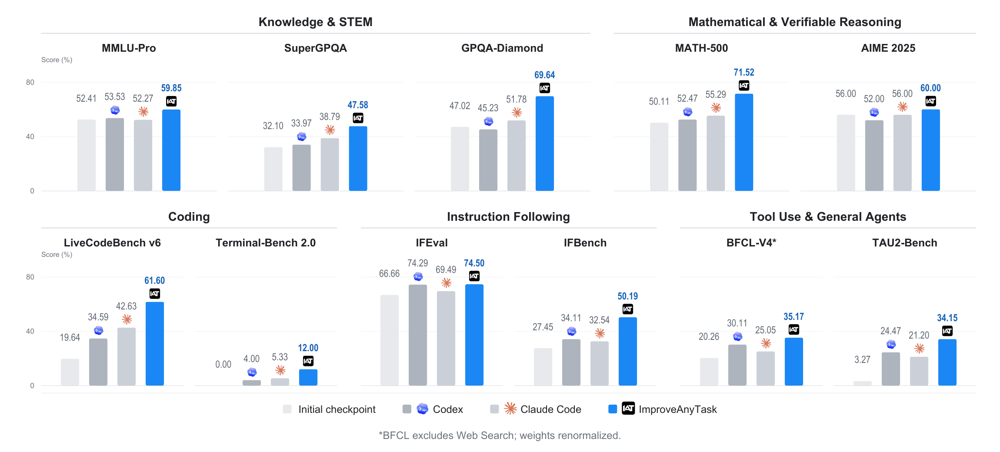

<h1 align="center">ImproveAnyTask</h1>

<p align="center">
  <strong>An Autonomous Post-Training Harness for Iterative Model Self-Improvement</strong>
</p>

<p align="center">
  <a href="https://arxiv.org/abs/2610.06347"><strong>Paper</strong></a> |
  <a href="https://improveanytask.github.io/"><strong>Project Page</strong></a>
</p>

<p align="center">
  
</p>

ImproveAnyTask is an autonomous post-training harness for iterative and recursive self-improvement of LLMs. It diagnoses model errors, selects research-backed update directions, and executes task-specific model updates under a fixed compute budget.

## Method

The harness connects three modules in a continuous optimization loop:

1. **Error Attribution** identifies the highest-impact model weakness from aggregate metrics and failure cases.
2. **Update Direction** compares research-backed strategies by expected gain, applicability, and reproduction difficulty.
3. **Executable Model Updates** translates the selected strategy into data and post-training, with execution checks before full training.

## Results

- Evaluated on **11 benchmarks** across five capability domains.
- Mean gains of **18.29** and **11.97** percentage points on Qwen3.5-4B-Base and Qwen3.5-4B-Instruct.
- Maximum gain of **41.96** percentage points on LiveCodeBench v6.
- Each optimization uses a **24-hour budget** with resources equivalent to eight NVIDIA H20 GPUs.

## Citation

```bibtex
@article{yao2026improveanytask,
  title   = {ImproveAnyTask: An Autonomous Post-Training Harness for Iterative Model Self-Improvement},
  author  = {Yao, Xingbo and Wang, Xiaoman and Lei, Zhengwu and Luo, Tinghui and Zhang, Yilin and Wu, Yuefeng and Xu, Yijie and Wang, Tianfu and Zhan, Qingyuan and Guo, Ye and Zhang, Daoxin and Xu, Zhe and Liu, Jian and Xiong, Hui},
  journal = {arXiv preprint arXiv:2610.06347},
  year    = {2026}
}
```

Machine-readable citation metadata is available in [`CITATION.cff`](CITATION.cff).
